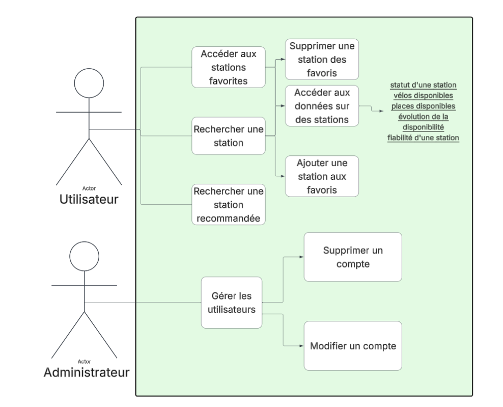

\begin{titlepage}
\raggedright

\includegraphics{ressources/ensai_logo_2.png}\\

\centering
\vspace{0.5cm}
{\LARGE\textsc{Rapport d'Analyse}}\\
\vspace{0.5cm}

\vspace{1.5cm}

\rule{\textwidth}{0.5mm}\\
\vspace{0.8cm}
{\huge\bfseries VeloScope}\\
\vspace{0.8cm}
\rule{\textwidth}{0.5mm}\\

\vspace{1.5cm}

\begin{flushleft}
\emph{Étudiant·e·s :}\\
Fanny BOUBY\\
Audrey DANJOIE\\
Romane DELANZY\\
Jean POHARDY\\
Elouan REGUIGNE GRANCHER\\
\end{flushleft}

\begin{flushright}
\emph{Responsable :}\\
Ludovic DENEUVILLE\\
\vspace{0.5cm}
\emph{Tuteur :}\\
André RIVIERE\\
\end{flushright}

\vfill 
\begin{center}
École nationale de la statistique et de l’analyse de l’information\\
2025--2026
\end{center}
\end{titlepage}

\tableofcontents

# Planning

## Diagramme de Gantt

# Etude préalable

## Cahier des charges

## Organisation du groupe

# Modèle de conception

## Diagrammes

### Diagramme des cas d'utilisation

### Diagramme d'activité

### Modèle des données

### Diagramme de classes

### Diagrammes de séquence

## Fonctionnalités de l'application

## Présentation des menus

## Liste des principaux composants
