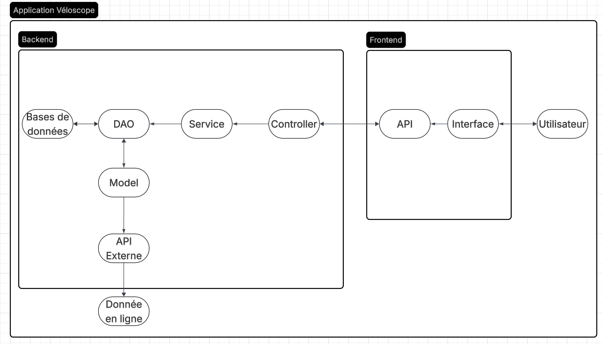

\begin{titlepage}
\raggedright

\includegraphics{../ressources/ensai_logo_2.png}\\

\centering
\vspace{0.5cm}
{\LARGE\textsc{Rapport d'Analyse}}\\
\vspace{0.5cm}

\vspace{1.5cm}

\rule{\textwidth}{0.5mm}\\
\vspace{0.8cm}
{\huge\bfseries VeloScope}\\
\vspace{0.8cm}
\rule{\textwidth}{0.5mm}\\

\vspace{1.5cm}

\begin{flushleft}
\emph{Étudiant·e·s :}\\
Fanny BOUBY\\
Audrey DANJOIE\\
Romane DELANZY\\
Jean POHARDY\\
Elouan REGUIGNE GRANCHER\\
\end{flushleft}

\begin{flushright}
\emph{Responsable :}\\
Ludovic DENEUVILLE\\
\vspace{0.5cm}
\emph{Tuteur :}\\
André RIVIERE\\
\end{flushright}

\vfill 
\begin{center}
École nationale de la statistique et de l’analyse de l’information\\
2026--2027
\end{center}
\end{titlepage}

\tableofcontents

\pagebreak

# Organisation du groupe

&nbsp;&nbsp;&nbsp;&nbsp;&nbsp;&nbsp;&nbsp;&nbsp; Le projet se décompose en une phase d'analyse et de conception générale qui se déroule jusqu'à fin septembre et que ce rapport traite, et une phase d'implémentation d'octobre à novembre. 
&nbsp;&nbsp;&nbsp;&nbsp; Pour ce qui est de l'organisation au sein du groupe, nous n'avons pas défini de rôle précis pour chacun pour cette phase d'analyse et de conception générale. Nous privilégions plutôt une réunion hebdomadaire au cours de laquelle le groupe se réunit pour présenter l'avancée des travaux, discuter des choix faits ou à faire et des tâches restantes et prioritaires. A l'issue de cette réunion, nous faisons une liste des travaux à réaliser pour la semaine suivante et nous nous les répartissons de manière équitable et en fonction des préférences et des dispositions de chacun. Bien que chacun privilégie les tâches auxquelles il est le plus préparé et disposé, le travail reste donc très collectif. Aussi, si des tâches nous semblent trop difficiles, nous les réalisons à plusieurs, ou avec l'ensemble du groupe lors des réunions hebdomadaires.

## Diagramme de Gantt

&nbsp;&nbsp;&nbsp;&nbsp;&nbsp;&nbsp;&nbsp;&nbsp; La planification du projet se fait grâce à un diagramme de GANTT que nous mettons à jour à chaque réunion hebdomadaire, en inscrivant les tâches finies et les nouvelles tâches à réaliser, ainsi que les membres du groupe qui se chargeront de chacune d'elles. Le diagramme de GANTT est donc un réel outil que nous utilisons chaque semaine pour nous organiser et faire le bilan de l'avancée de nos travaux.

# Etude préalable

## Cahier des charges

L'application doit comporter 5 fonctions principales et indispensables qui : 

* permettront la collecte des données à travers l'API, qui sera interrogée toutes les 15 minutes pour récupérer des informations sur chaque station

* permettront aux utilisateurs la gestion de leur compte et la consultation des données et statiques. Un compte admin pourra également gérer les utilisateurs (supprimer des comptes, modifier des informations)

* permettront aux utilisateurs de consulter une station à travers une barre de recherche, pour afficher l'état d'une station, le nombre de vélos disponibles, la capacité de la station, son taux de remplissage et l'évolution des disponibilités sur les dernières 24h, 7 jours, ou 30 derniers jours.  

* permettront d'afficher le score de fiabilité d'une station en fonction de son statut parmi vide, saturée et fonctionnelle. Une station sera considérée comme vide si aucun vélo n'y est disponible, saturée s'il n'y a plus de places pour ranger son vélo, et fonctionnelle dans les autres cas. Cette fonctionnalité utilisera l'historique pour calculer des statistiques en fonction du statut de la station au cours du temps, et retournera un score global de fiabilité de la station.  

* recommander une station à proximité de l'utilisateur en fonction de la distance et de la fiabilité des stations.  

Il faudra donc trouver un réseau de location de vélos dont l'API pourra récupérer les informations suivantes : 

* nom de chaque station
* nombre de vélos disponibles pour chaque station et pour chaque type de vélo (électrique ou simple)
* nombre de places disponibles dans chaque station
* état de chaque station

# Modèle de conception

## Diagrammes

### Diagramme des cas d'utilisation

&nbsp;&nbsp;&nbsp;&nbsp;&nbsp;&nbsp;&nbsp;&nbsp; Il s'agit du premier diagramme que nous avons réalisé dans le cadre du projet. Il a pour objectif de représenter le fonctionnement de l'application que nous avons créée.

&nbsp;&nbsp;&nbsp;&nbsp;&nbsp;&nbsp;&nbsp;&nbsp; Deux profils d'utilisateurs existent sur l'application : le profil utilisateur et le profil administrateur. Chacun doit créer puis se connecter à un compte auquel est associée la fonction utilisateur ou administrateur. Le compte administrateur permet de gérer les utilisateurs, c'est-à-dire modifier leurs données ou supprimer des comptes par exemple. Le compte utilisateur est celui qui donne accès au plus grand nombre de fonctionnalités. Parmi les fonctionnalités principales, un utilisateur peut rechercher une station afin d'accéder à ses données et statistiques, ajouter une station à ses favoris pour que son accès via l'application soit plus direct, plus largement gérer ses stations favorites, et demander une suggestion de station en fonction de sa fiabilité.

### Diagramme d'architecture

&nbsp;&nbsp;&nbsp;&nbsp;&nbsp;&nbsp;&nbsp;&nbsp;  Le diagramme d’architecture présente les différentes composantes de l'application Véloscope ainsi que le manière dont elles intéragissent entre elles. L'application est divisée en deux grandes parties : Le Backend qui contient la logique de gestion des données, et le Frontend qui permet à l'utilisateur d'intéragir avec l'application. L'application communique également avec une source de données externe afin de récupérer les informations sur des stations de vélo.

&nbsp;&nbsp;&nbsp;&nbsp;&nbsp;&nbsp;&nbsp;&nbsp; L'utilisateur est à l'extérieur de l'application. Via l'interface, il effectue des requêtes auxquelles l'application doit pouvoir répondre. L'interface communique avec l'API et transmet les demandes au Backend. C'est le controller qui les reçoit et les transmet aux modules en capacité d'y répondre.

&nbsp;&nbsp;&nbsp;&nbsp;&nbsp;&nbsp;&nbsp;&nbsp; C'est la partie Service qui contient la logique métier. C'est au sein des services que l'on retrouve tout ce que l'application doit savoir faire et les règles qui déterminent sa manière de fonctionner. Ils réalisent nottament des calculs comme le taux de remplissage.

&nbsp;&nbsp;&nbsp;&nbsp;&nbsp;&nbsp;&nbsp;&nbsp; La partie Model permet de structurer les données utilisées par l'application. Elle associe à chaque objet l'ensemble des informations qui lui appartiennent. Une station dispose par exemple toujours d'un identifiant, d'un nom, d'une capacité et une position géographique. Elle est utilisé par le Parser et le Controller pour manipuler les données de manière structurée. 

&nbsp;&nbsp;&nbsp;&nbsp;&nbsp;&nbsp;&nbsp;&nbsp; Le DAO (Data Access Object) assure la communication avec la base de donnée. Il permet de lire et d'enregistrer et modifier les données nécessaires au fonctionnement de notre application. Dans notre projet, ces données sont stockées dans une base de données PostgreSQL.

&nbsp;&nbsp;&nbsp;&nbsp;&nbsp;&nbsp;&nbsp;&nbsp; L'API externe est la source depuis laquelle nous recueillons les données nécessaires au développement de notre application. Elle fournit les informations à propos des stations et de leur disponibilité. Les données en ligne correspondent ainsi aux informations disponibles à propos des vélos et stations du réseau choisi. 

&nbsp;&nbsp;&nbsp;&nbsp;&nbsp;&nbsp;&nbsp;&nbsp; Finalement, le fonctionnement général de notre application repose sur deux flux principaux. D'une part, toutes les 15 minutes, les données provenant de API externe sont récupérées, traitées et enregistrées. D'autre part, lorsqu'un utilisateur effectue une demande via l'interface, elle passe par l'API et est prise en charge par le Controller. Le Service effectue les traitements nécessaires. Les données sont récupérées grâce au DAO afin de fournir une réponse à l'utilisateur.

### Diagramme d'activité

&nbsp;&nbsp;&nbsp;&nbsp;&nbsp;&nbsp;&nbsp;&nbsp; Ce diagramme d'activité représente les grandes étapes de la recherche d'une station par l'utilisateur. Il commence par saisir le nom d'une ville. En renseignant sa position, l'application lui renvoie la station la plus proche. Si une station est trouvée, l'application récupère les informations asscoiées les plus récentes. Il peut ensuite lancer une nouvelle recherche au sein de la même ville, rechercher une nouvelle ville ou mettre fin à ses recherches. 

&nbsp;&nbsp;&nbsp;&nbsp;&nbsp;&nbsp;&nbsp;&nbsp; Le diagramme d'activité ci-dessus est davantage détaillé. Lorsque l'utilisateur recherche une ville, il est confronté à différentes réponses de l'application. Dans le premier cas, la ville n'est pas reconnue. L'utilisateur doit relancer une recherche. Si les trois premiers caractères sont reconnus, l'application affiche la liste des villes correspondantes. Si la ville recherchée y figure ou si la ville avait été direcment reconnue, l'utilisateur peut choisir une station. Si la station est reconnue, l'application affiche les informations associées et la requête prend fin. De la même manière que pour les villes, une chaîne de trois caractères permet d'afficher une liste de stations correpondantes. Si la station recherchée n'apparaît pas, l'utilisateur est invité à saisir un nom de station différent. Si la station est présente dans la liste, l'utilisateur la sélectionne et les informations associées s'affichent. L'utilisateur peut mettre fin à sa recherche, rechercher une autre ville ou une autre station. 

### Modèle des données

&nbsp;&nbsp;&nbsp;&nbsp;&nbsp;&nbsp;&nbsp;&nbsp; Le modèle de données représente les différentes entités utilisées par l'application et leurs liens entre elles.

&nbsp;&nbsp;&nbsp;&nbsp;&nbsp;&nbsp;&nbsp;&nbsp; L'élément "Réseau" correspond au réseau de vélos en libre-service qui est associé à une ville. L'entité "Infos_stations" contient les informations sur chaque station. Elle est à la fois reliée à l'historique des relevés et aux favoris de chaque utilisateur. La table "Historique_stations" contient les relevés successifs récupérés par l'API pour chacune des stations. Chaque relevé est unique car la table contient deux clés primaires : l'identifiant de la station et la date et l'heure du relevé. La table "Statistiques_stations" stocke les statistiques et indicateurs calculés à partir de l'historique. La table "Favoris" fait le lien entre "Utilisateurs" et "Infos_stations" parce qu'un utilisateur peut ajouter plusieurs stations à ses favoris, et une même station peut être mise dans les favoris par plusieurs utilisateurs différents. L'élément "Utilisateurs" contient les informations de compte, notamment un booléen `admin` qui distingue les comptes administrateurs des comptes utilisateurs. 

### Diagramme de classes

#### Module Controller:

&nbsp;&nbsp;&nbsp;&nbsp;&nbsp;&nbsp;&nbsp;&nbsp; La couche Controller se compose de 6 classes, 5 étant associées à un service métier et une 6ème pour gérer l’authentification d’un utilisateur à son compte. Le controller est l’interface entre une requête sur le site Streamlit VeloScope et le service métier. Il reçoit une requête depuis le site, par exemple une demande de création de compte en format JSON, et se charge de convertir cette requête en objet Python grâce à FastAPI/Pydantic et de transmettre cet objet au service métier. Des classes supplémentaires BaseModel, non représentées sur le diagramme de classes, pourront être créées afin de faciliter la première conversion JSON/objet Python.

Les classes concernées sont les suivantes :

* CompteController : La classe permet de transmettre l’information pour créer un compte (admin ou utilisateur), mettre à jour ses informations, le supprimer, lister tous les comptes, ou encore rechercher un compte grâce à son identifiant (ce qui peut être utile en tant qu’admin). (F1)
    
* AuthController : Elle reçoit la demande de connexion de l’utilisateur depuis Streamlit, la convertit en objet Python et transmet cette demande à CompteService pour vérifier la conformité de l’identifiant et du mot de passe.
    
* FavoriController : Si une demande d’ajout ou de suppression de favori est faite par un utilisateur, la classe se charge de la transmettre. Elle permettra aussi de faire le lien avec l’application Streamlit pour qu’un utilisateur puisse avoir accès à sa liste de favoris. (F1)
    
* StationController : Elle sert à recevoir les demandes liées aux stations et à les transmettre à StationService. Cela correspond à la fonctionnalité F3. Si un utilisateur veut consulter les stations de la ville de Bordeaux, savoir si une station est disponible ou non, savoir le nombre de vélos électriques dans une station, etc.
    
* RecommendationController : Classe Controller relative à la fonctionnalité F5. Elle permet de transmettre la position courante de l’utilisateur quand celui-ci fait une demande de recommandation afin de prendre en compte la distance à une station pour la pertinence. L’information est transmise à RecommendationService.
    
* FiabilityController : Correspond à la fonctionnalité F4. Comme un score de fiabilité doit être calculé pour chaque station, lors d’une recherche de station ou d’une recommandation, l’utilisateur doit pouvoir accéder au score de fiabilité. On pourrait aussi imaginer un scénario où le score de fiabilité n’est pas affiché dès le départ lors de la recherche d’une station et l’utilisateur en fait la demande explicite, bien que cela soit moins intuitif. La demande est transmise à FiabilityService.

#### Module Sevice:

&nbsp;&nbsp;&nbsp;&nbsp;&nbsp;&nbsp;&nbsp;&nbsp; Il s’agit de la couche métier de notre application VeloScope. Elle reçoit les demandes des Controllers, applique les règles métier, réalise les calculs nécessaires (calcul de la fiabilité, recommandation d’une station…) et coordonne les appels à la couche DAO pour obtenir les informations nécessaires aux demandes. C’est la couche intermédiaire entre l’API/Controller qui reçoit les demandes extérieures et la couche DAO qui se charge d’obtenir ou de modifier les données nécessaires. Pour effectuer les calculs et obtenir les informations, elle utilise les objets métier Python (Station, Compte…). Une fois les opérations effectuées, elle retourne le résultat à la couche Controller afin que ce dernier soit transmis à l’utilisateur. Les classes concernées sont les suivantes :

* CompteService : Gère les opérations métier qui concernent les comptes : créer un compte, modifier ses informations, le supprimer, rechercher un compte grâce à son identifiant, vérifier les identifiants de connexion, gérer les droits (admin ou non). Il communique avec CompteDAO pour avoir les informations dans la base de données. Par exemple, si un utilisateur veut se connecter, l’information reçue par le Controller est transmise à CompteService qui appelle CompteDAO pour retrouver le compte et vérifier le mot de passe.
  
* FavoriService : Gère les opérations concernant les favoris d’un utilisateur. Permet d’ajouter un favori (en vérifiant que la station n’est pas déjà dans la liste de favoris), d’en supprimer un ou d’accéder à tous les favoris d’un utilisateur. Il communique avec FavoriDAO.
  
* StationService : Gère les demandes de consultation et de recherche des stations : consulter les informations d’une station grâce à son identifiant, savoir si la station est opérationnelle, préparer les données nécessaires à l’affichage (notamment l’historique). Il communique avec StationDAO et StationStatusDAO.
  
* RecommendationService : Le service qui construit les recommandations de stations. Il permet de calculer la distance entre la position d’un utilisateur (reçue depuis RecommendationController) et une station, d’en sortir les stations les plus proches, de calculer un score pour classer les recommandations, et d’envoyer au Controller les stations recommandées. Pour les recommandations, il pourra aussi prendre en compte les critères de l’utilisateur. Comme la recommandation prendra en compte le score de fiabilité, il communique avec FiabilityService. Il récupère les informations nécessaires relatives aux stations grâce à StationDAO et StationStatusDAO.
  
* FiabilityService : S’occupe de la logique métier liée à la fiabilité des stations. Regarde si la station est vide, pleine, fonctionnelle, son pourcentage historique d’indisponibilité, le temps passé vide/saturée, la durée moyenne des épisodes de saturation et de pénurie, ainsi que le calcul du score global de fiabilité d’une station selon une règle qui reste à définir. Communique avec StationStatusDAO. 

#### Module DAO:

&nbsp;&nbsp;&nbsp;&nbsp;&nbsp;&nbsp;&nbsp;&nbsp; Comme expliqué ci-dessus, le DAO a pour rôle de recueillir les données de l’API externes et des utilisateurs, de les enregistrer et de les restituer sur demande du module Service. Ainsi, ce module possède 4 classes différentes qui découlent de notre modèle de données :

* La classe CompteDAO a pour rôle de recueillir les informations des utilisateurs via la méthode create pour créer leur compte ou via la méthode update pour changer leurs informations personnelles. L’administrateur pourra, à l’inverse des utilisateurs, modifier les informations publiques de tous les utilisateurs comme leurs username ou leurs emails. Ce dernier pourra également supprimer des comptes si nécessaire via la méthode delete. L’administrateur pourra également, via la méthode find_by_id ou list_all faire des recherches sur les utilisateurs.La fonction login, quant à elle, vérifiera si le mot de passe correspond bien avec le nom de l'utilisateur, puis retourne un booléen qui sera renvoyé en passant par le service CompteService à la classe AuthController qui donnera ou non l’authentification de l’utilisateur.

* La classe FavoriDAO a pour but via ses méthodes add_favorite et remove_favorite de permettre d'actualiser la liste des stations favorites de l'utilisateur. La méthode user_favorite permet de récupérer la liste des stations favorites de l'utilisateur. 

* La classe StationDAO a pour but de stocker et d'actualiser les informations statiques des stations (coordonnées GPS,  adresse, nom, capacité). Les méthodes create et create_or_update permettent d’ajouter de nouvelles stations ou de modifier les données existantes d’une station. Les méthodes find_by_id et list_all ayant le rôle de restituer les informations d’une station ou d'obtenir la liste complète.

* La classe StationStatusDAO s’occupe de stocker l’historique au cours du temps de la station. Elle est actualisée toutes les 15 min par l’API externe. La méthode create_status enregistre les données d’un nouveau relevé pour une station. La méthode find_current_status s’occupe de restituer le dernier relevé d’état d’une station, contrairement à la méthode find_history qui renvoie tous les relevés d’une station entre deux dates.

&nbsp;&nbsp;&nbsp;&nbsp;&nbsp;&nbsp;&nbsp;&nbsp; La méthode get_connection permet d'allouer la connexion à un DAO qui la rend via la méthode release_connection pour qu’elle soit de nouveau disponible pour la prochaine requête. La méthode close_all mettant fin à la connexion quand l’application est fermée.

#### Module API Externe:

\begin{figure}[htbp]
\centering
\includegraphics[width=0.4\textwidth]{../ressources/Diagramme/Diagramme classes API Externe.pdf}
\caption{Diagramme de classes du module API Externe}
\end{figure}

&nbsp;&nbsp;&nbsp;&nbsp;&nbsp;&nbsp;&nbsp;&nbsp; Ce module a pour but d’envoyer au DAO des données régulières provenant d’une base de données extérieure. Dans ce projet son objectif est donc de fournir toutes les 15 minutes des données sur les vélos en libre-service.

* La classe CollectionService a pour but d’établir la connexion avec l’API externe et d'envoyer les données reçues au DAO et plus précisément aux classes StationStatusDAO et StationDAO. La méthode run_connexion ayant pour but d'automatiser la collecte de données toutes les 15 min en envoyant des requêtes à la classe GFBSProvider.

* La classe GFBSProvider est une classe mère ayant pour but de standardiser les méthodes de collecte de données. Ceci nous permettant de facilement ajouter de nouveaux réseaux à analyser pour notre application. La méthode get_station se chargeant de récupérer la liste statique des stations alors que la méthode get_station_status récupère les données dynamiques de la station comme son nombre de vélo disponible entre autres.

* La classe BordeauGFBSProvider hérite de la classe GFBSProvider et s’occupe directement de la récupération de données sur le réseau de Bordeaux. Elle fait appel à la classe GFBSClient pour récupérer les données qui sont ensuite transformées en objet via la classe BordeauxGFBSAdapter pour que les données soient lisibles pour le DAO.

*La classe GFBSClient s’occupe de formuler les requêtes html vers l’API externe et récupère les données brutes. La méthode get_information_station captant les données statiques des stations et la méthode get_station_status captant les données dynamiques des stations.

* La classe BordeauGFBSAdapter transforme via la méthode to_station les données statiques des stations reçues de GFBSClient en objets Station et fait de même avec les données dynamiques via la méthode to_station_status, transformée en objet StationStatus.

### Diagrammes de séquence

&nbsp;&nbsp;&nbsp;&nbsp;&nbsp;&nbsp;&nbsp;&nbsp;  Ces diagrammes décrivent les interactions entre les différentes couches de l'application lorsqu'un scénario particulier se déroule. Chacun met en évidence le rôle précis de chaque couche : le déclencheur (utilisateur ou planificateur automatique), le service qui orchestre le traitement, la DAO qui accède aux données, et la base de données qui les stocke ou les restitue. Le premier diagramme détaille la collecte périodique des données depuis l'API GBFS de la ville, le deuxième le calcul du score de fiabilité d'une station, et le troisième la recommandation d'une station à proximité de l'utilisateur.

&nbsp;&nbsp;&nbsp;&nbsp;&nbsp;&nbsp;&nbsp;&nbsp;  Ce diagramme présente la collecte périodique des données depuis l'API GBFS de la ville choisie. Le planificateur va, à intervalle régulier, déclencher le lancement de la collecte auprès du service Collecteur. Celui-ci va alors interroger l'adaptateur GBFS, qui se charge à son tour d'envoyer la requête vers l'API externe de la ville et de récupérer sa réponse. Le service Collecteur va ensuite déterminer, à partir des données brutes reçues (nombre de vélos disponibles, nombre de places libres), l'état de chaque station : vide, saturée ou fonctionnelle. Pour chaque station reçue, le service va alors appeler la couche DAO afin d'enregistrer un nouveau relevé dans la base de données d'historique. Contrairement à une simple mise à jour, chaque relevé est ajouté sans écraser les précédents, ce qui permet de reconstruire l'état du réseau à n'importe quel instant passé. Une fois toutes les stations traitées, le service informe le planificateur que la collecte est terminée.

&nbsp;&nbsp;&nbsp;&nbsp;&nbsp;&nbsp;&nbsp;&nbsp;  Ce diagramme explique le calcul périodique du score de fiabilité de chaque station. Comme pour la collecte, c'est le planificateur qui va déclencher le traitement, cette fois auprès du service de fiabilité. Celui-ci va d'abord demander à la couche DAO la liste de toutes les stations existantes. Pour chaque station, le service va ensuite récupérer, via la DAO, l'ensemble de son historique de relevés stocké en base. À partir de ces données, il va calculer plusieurs indicateurs : le pourcentage de temps passé vide, le pourcentage de temps passé saturée, ainsi que la durée moyenne des épisodes de pénurie et de saturation. Ces indicateurs sont combinés pour obtenir un score global, que le service va ensuite faire enregistrer par la DAO dans la base des scores de fiabilité. Une fois toutes les stations traitées, le service confirme au planificateur que le calcul est terminé.

&nbsp;&nbsp;&nbsp;&nbsp;&nbsp;&nbsp;&nbsp;&nbsp; Ce diagramme illustre la recommandation d'une station à proximité, initiée cette fois par l'utilisateur plutôt que par le planificateur. L'utilisateur va indiquer sa position depuis la couche de présentation, qui transmettra la demande au service de recommandation. Ce dernier va d'abord appeler la DAO afin de récupérer, dans la base des stations, celles qui se trouvent à proximité de la position indiquée. Il va ensuite demander à la DAO les données les plus récentes de disponibilité de ces stations, ainsi que leur score de fiabilité déjà calculé et stocké en base. Une fois toutes ces informations réunies, le service va calculer un classement pondéré combinant la distance, le nombre de vélos disponibles, la fiabilité historique et la disponibilité de vélos électriques. Le résultat sera enfin renvoyé à la couche de présentation, qui affichera à l'utilisateur la liste des stations recommandées, triées par pertinence.

## Fonctionnalités de l'application

&nbsp;&nbsp;&nbsp;&nbsp;&nbsp;&nbsp;&nbsp;&nbsp; L'application vise à faciliter l'usage de réseaux de vélos en libre-service en permettant à ses utilisateurs de voir clairement en temps réel la disponibilité des stations et en l'analysant dans le temps. L'application a aussi vocation à proposer des recommandations de stations aux utilisateurs en fonction de leurs besoins spécifiques et des tendances observées à travers l'historique des stations. 

#### La gestion des utilisateurs

&nbsp;&nbsp;&nbsp;&nbsp;&nbsp;&nbsp;&nbsp;&nbsp; Chaque utilisateur peut se créer un compte personnel puis se connecter à l'application. Une fois connecté à l'application, l'utilisateur a accès à toutes es données et statistiques, et peut enregistrer ses stations préférées comme favorites, ce qui lui permettra d'y accéder plus rapidement. Certains utilisateurs sont aussi administrateurs, ce qui leur permet de gérer les utilisateurs : supprimer des comptes, réinitialiser les mots de passe, etc. 

#### La collecte des données

&nbsp;&nbsp;&nbsp;&nbsp;&nbsp;&nbsp;&nbsp;&nbsp; La collecte des données se fait à travers le DAO qui interroge l'API toutes les 15 minutes pour en récupérer les données puis les stocker dans une base PostgreSQL qui conservera un historique complet. 

&nbsp;&nbsp;&nbsp;&nbsp;&nbsp;&nbsp;&nbsp;&nbsp; Les informations récupérées par le DAO seront : 

* le nom de la station
* la date et l'heure de l'actualisation de l'API
* le nombre de vélos disponibles
* le nombre de places disponibles
* le nombre de vélos électriques
* l'état de la station

#### La consultation d'une station

&nbsp;&nbsp;&nbsp;&nbsp;&nbsp;&nbsp;&nbsp;&nbsp; L'utilisateur peut rechercher une station et en consulter les informations, dont : 

* son état actuel
* le nombre de vélos disponibles
* sa capacité
* son taux de remplissage
* l'évolution de sa disponibilité sur une période choisie entre : les dernières 24 heures, les 7 derniers jours et le 30 derniers jours.

#### Le score de fiabilité

&nbsp;&nbsp;&nbsp;&nbsp;&nbsp;&nbsp;&nbsp;&nbsp; Cette fonctionnalité attribue à chaque station un score qui reflète sa fiabilité dans le temps. 

&nbsp;&nbsp;&nbsp;&nbsp;&nbsp;&nbsp;&nbsp;&nbsp; Pour chaque appel de l'API, un statut est accordé à la station : la station est qualifiée de vide si elle n'a plus de vélo disponible, saturée si elle n'a plus de place disponible, et fonctionnelle dans les autres cas.

&nbsp;&nbsp;&nbsp;&nbsp;&nbsp;&nbsp;&nbsp;&nbsp; A partir de ces données récoltées au fur et à mesure des actualisations de l'API, l'application calcule le pourcentage de temps passé vide ou saturée, et la durée moyenne des périodes de saturation ou de pénurie. A partir de ces statistiques et de l'évolution du statut au cours du temps, un score de fiabilité est calculé.

#### La recommandation de station

&nbsp;&nbsp;&nbsp;&nbsp;&nbsp;&nbsp;&nbsp;&nbsp; L'application peut proposer des recommandations de stations à chaque utilisateur en fonction :

* de la distance entre l'utilisateur et la station 
* de l'état actuel de la station (nombre de vélos disponibles, électriques ou non en fonction des préférences de l'utilisateur)
* de la fiabilité historique de la station et de ses tendances récentes

&nbsp;&nbsp;&nbsp;&nbsp;&nbsp;&nbsp;&nbsp;&nbsp; Nous avons réflechi à différentes manières de mettre en place cette fonction. Même si nous ne sommes qu'à l'étape de la réflexion, celle qui nous semble pour l'instant la plus pertinente est la suivante. Nous coefficientons chaque critère en fonction de l'importance que nous lui accordons. 35% pour la distance, 25% pour le nombre de vélos disponibles, 15% pour la fiabilité historique, 15% pour la disponibilité de vélo électrique et 10% pour la tendance récente. 

&nbsp;&nbsp;&nbsp;&nbsp;&nbsp;&nbsp;&nbsp;&nbsp; Pour la distance, nous fixons une distance maximale, 2 kilomètres par exemple et on calcule le quotient entre la distance de la station et la distance maximale. Une station à 0 mètres rapporte 100 points, 50 pour une à 1 kilomètre et 0 pour une à 2 kilomètres. 

&nbsp;&nbsp;&nbsp;&nbsp;&nbsp;&nbsp;&nbsp;&nbsp; Pour le nombre de vélos disponibles, une station vide n'est pas prise en compte pour les recommandations. Pour les autres nous pensons diviser le nombre de vélos disponibles par la capacité de la station. Une station avec deux vélos disponibles sur 10 semble plus intéressante qu'une station de 40 places avec deux vélos disponibles. Le calcul pourra être le même pour les vélos électriques à noter que nous pourrions, à l'inscription sur l'application demander à l'utilisateur par quel type de vélo il est intéressé. Si les vélos électriques ne l'intéressent pas ce coefficient pourrait être réduit à 0. 

Pour la fiabilité, nous utiliserons à la fois le temps passé vide, le temps passé saturé, la durée moyenne de pénurie et la durée moyenne saturée.

#### Autres fonctionnalités

&nbsp;&nbsp;&nbsp;&nbsp;&nbsp;&nbsp;&nbsp;&nbsp; Nous nous concentrons pour l'instant sur les fonctionnalités obligatoires, mais avons commencé à appréhender les fonctionnalités facultatives (cf diagrammes de séquence).

## Présentation des menus

#### Menu 1 : Connexion et inscription

&nbsp;&nbsp;&nbsp;&nbsp;&nbsp;&nbsp;&nbsp;&nbsp; Au lancement de l'application, l'utilisateur accède à un écran lui permettant de se connecter avec son compte existant ou de créer un nouveau compte. Une fois connecté, il accède à l'ensemble des fonctionnalités de l'application.

#### Menu 2 : Carte du réseau

&nbsp;&nbsp;&nbsp;&nbsp;&nbsp;&nbsp;&nbsp;&nbsp; C'est l'écran principal de l'application. Il présente l'ensemble des stations du réseau, avec pour chacune le nombre de vélos disponibles et le nombre de places libres en temps réel. L'utilisateur peut parcourir le réseau visuellement et sélectionner une station pour en consulter le détail.

#### Menu 3 : Détail d'une station

&nbsp;&nbsp;&nbsp;&nbsp;&nbsp;&nbsp;&nbsp;&nbsp;En sélectionnant une station, l'utilisateur accède à une fiche détaillée présentant son état actuel (disponible, vide, saturée), sa capacité totale, ainsi que son taux de remplissage. Il peut choisir une période de consultation (dernières 24 heures, 7 derniers jours ou 30 derniers jours) pour visualiser l'évolution de la disponibilité de la station sur cette période. Ce même écran affiche également le score de fiabilité de la station, calculé à partir de son historique : le pourcentage de temps passé vide ou saturée, ainsi que la durée moyenne de ces épisodes. L'utilisateur peut, depuis cet écran, ajouter ou retirer la station de ses favoris.

#### Menu 4 : Mes stations favorites

&nbsp;&nbsp;&nbsp;&nbsp;&nbsp;&nbsp;&nbsp;&nbsp; Cet écran regroupe l'ensemble des stations que l'utilisateur a marquées comme favorites, avec pour chacune son état actuel affiché directement, sans avoir à les rechercher une à une sur la carte du réseau.

#### Menu 5 : Recherche d'itinéraire

&nbsp;&nbsp;&nbsp;&nbsp;&nbsp;&nbsp;&nbsp;&nbsp; L'utilisateur saisit une adresse de départ et une adresse d'arrivée. L'application lui propose alors une station de départ et une station d'arrivée adaptées, ainsi que le temps de trajet et la distance estimés. La proposition ne se limite pas à la station la plus proche : elle tient compte également du nombre de vélos actuellement disponibles, de la fiabilité historique de la station et de la présence éventuelle de vélos électriques, afin de proposer le trajet le plus pertinent plutôt que le plus court. L’itinéraire à suivre est tracé sur la carte interactive.

#### Menu 6 : Gestion des utilisateurs (administrateur)

&nbsp;&nbsp;&nbsp;&nbsp;&nbsp;&nbsp;&nbsp;&nbsp; Réservé aux comptes administrateur, cet écran permet de consulter la liste des utilisateurs inscrits, de créer ou supprimer un compte, et de modifier le rôle d'un utilisateur.

