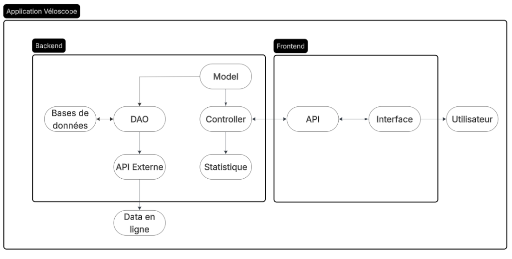
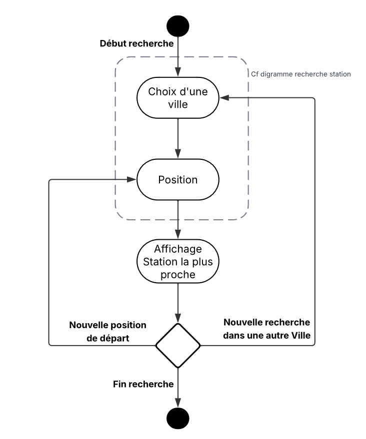
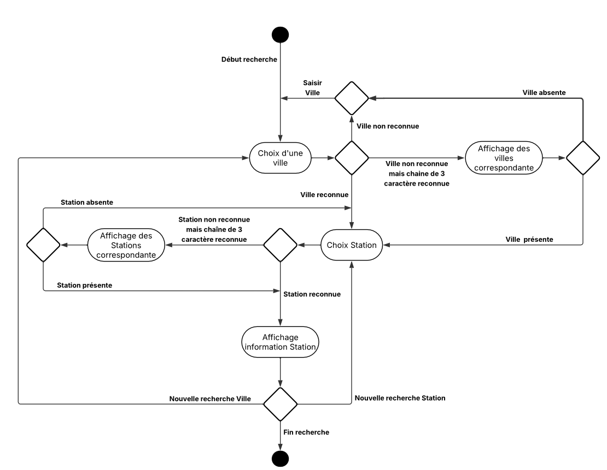
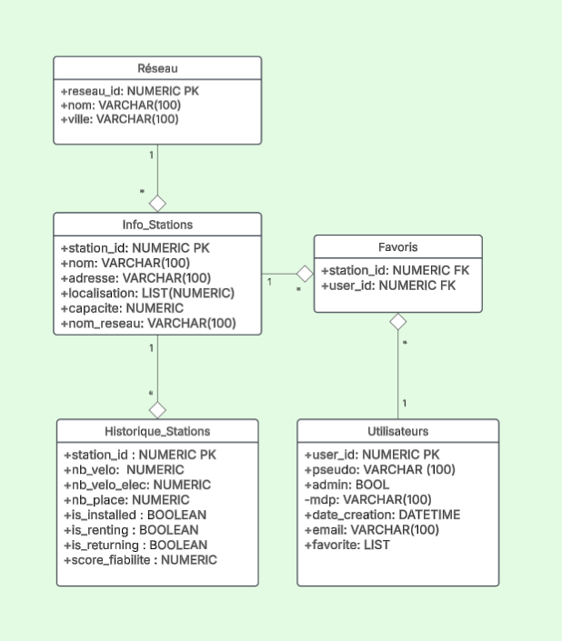
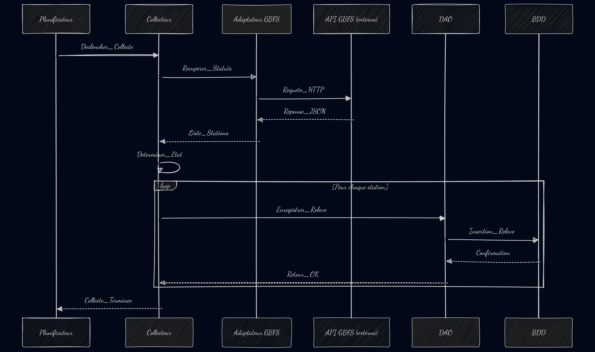
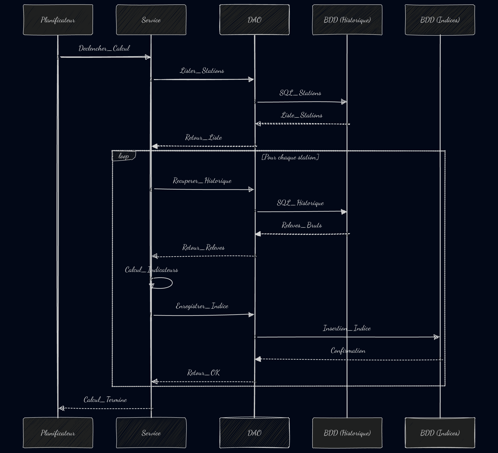
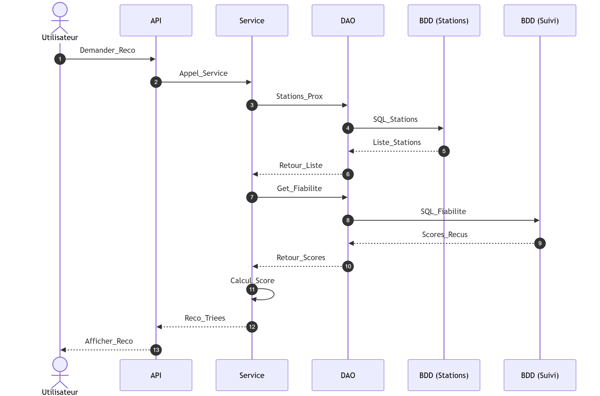

\begin{titlepage}
\raggedright

\includegraphics{../ressources/ensai_logo_2.png}\\

\centering
\vspace{0.5cm}
{\LARGE\textsc{Rapport d'Analyse}}\\
\vspace{0.5cm}

\vspace{1.5cm}

\rule{\textwidth}{0.5mm}\\
\vspace{0.8cm}
{\huge\bfseries VeloScope}\\
\vspace{0.8cm}
\rule{\textwidth}{0.5mm}\\

\vspace{1.5cm}

\begin{flushleft}
\emph{Étudiant·e·s :}\\
Fanny BOUBY\\
Audrey DANJOIE\\
Romane DELANZY\\
Jean POHARDY\\
Elouan REGUIGNE GRANCHER\\
\end{flushleft}

\begin{flushright}
\emph{Responsable :}\\
Ludovic DENEUVILLE\\
\vspace{0.5cm}
\emph{Tuteur :}\\
André RIVIERE\\
\end{flushright}

\vfill 
\begin{center}
École nationale de la statistique et de l’analyse de l’information\\
2026--2027
\end{center}
\end{titlepage}

\tableofcontents

\pagebreak

# Organisation du groupe

&nbsp;&nbsp;&nbsp;&nbsp;&nbsp;&nbsp;&nbsp;&nbsp; Le projet se décompose en une phrase d'analyse et de conception générale qui se déroule jusqu'à fin septembre et que ce rapport traite, et une phase d'implémentation d'octobre à novembre. 
&nbsp;&nbsp;&nbsp;&nbsp; Pour ce qui est de l'organisation au sein du groupe, nous n'avons pas défini de rôle précis pour chacun pour cette phase d'analyse et de conception générale. Nous privilégions plutôt une réunion hebdomadaire au cours de laquelle le groupe se réunit pour présenter l'avancée des travaux, discuter des choix faits ou à faire et des tâches restantes et prioritaires. A l'issue de cette réunion, nous faisons une liste des travaux à réaliser pour la semaine suivante et nous nous les répartissons de manière équitable et en fonction des préférences et des dispositions de chacun. Bien que chacun privilégie les tâches auxquelles il est le plus préparé et disposé, le travail reste donc très collectif. Aussi, si des tâches nous semblent trop difficiles, nous les réalisons à plusieurs, ou avec l'ensemble du groupe lors des réunions hebdomadaires.

## Diagramme de Gantt

&nbsp;&nbsp;&nbsp;&nbsp;&nbsp;&nbsp;&nbsp;&nbsp; La planification du projet se fait grâce à un diagramme de GANTT que nous mettons à jour à chaque réunion hebdomadaire, en inscrivant les tâches finies et les nouvelles tâches à réaliser, ainsi que les membres du groupe qui se chargeront de chacune d'elles. Le diagramme de GANTT est donc un réel outil que nous utilisons chaque semaine pour nous organiser et faire le bilan de l'avancée de nos travaux.

# Etude préalable

## Cahier des charges

L'application doit comporter 5 fonctions principales et indispensables qui : 

* permettront la collecte des données à travers l'API, qui sera interrogée toutes les 15 minutes pour récupérer des informations sur chaque station
&nbsp;&nbsp;&nbsp;&nbsp;

* permettront aux utilisateurs la gestion de leur compte et la consultation des données et statiques. Un compte admin pourra également gérer les utilisateurs (supprimer des comptes, modifier des informations)

* permettront aux utilisateurs de consulter une station à travers une barre de recherche, pour afficher l'état d'une station, le nombre de vélos disponibles, la capacité de la station, son taux de remplissage et l'évolution des disponibilités sur les dernières 24h, 7 jours, ou 30 derniers jours.  

* permettront d'afficher le score de fiabilité d'une station en fonction de son statut parmi vide, saturée et fonctionnelle. Une station sera considérée comme vide si aucun vélo n'y ets disponibles, saturée s'il n'y a plus de places pour ranger son vélo, et fonctionnelle dans les autres cas. Cette fonctionnalité utilisera l'historique pour calculer des statistiques en fonction du statut de la station au cours du temps, et retournera un score global de fiabilité de la station.  

* recommander une station à proximité de l'utilisateur en fonction de la distance et de la fiabilité des stations.  

Il faudra donc trouver un réseau de location de vélos dont l'API pourra récupérer les informations suivantes : 

* nom de chaque station
* nombre de vélos disponibles pour chaque station et pour chaque type de vélo (électrique ou simple)
* nombre de places disponibles dans chaque station
* état de chaque station

# Modèle de conception

## Diagrammes

### Diagramme des cas d'utilisation

&nbsp;&nbsp;&nbsp;&nbsp;&nbsp;&nbsp;&nbsp;&nbsp; Il s'agit du premier diagramme que nous avons réalisé dans le cadre du projet. Il a pour objectif de représenter le fonctionnement de l'application que nous avons créée.

&nbsp;&nbsp;&nbsp;&nbsp;&nbsp;&nbsp;&nbsp;&nbsp; Deux profils d'utilisateurs existent sur l'application : le profil utilisateur et le profil administrateur. Chacun doit créer puis se connecter à un compte auquel est associée la fonction utilisateur ou administrateur. Le compte administrateur permet de gérer les utilisateurs, c'est-à-dire modifier leurs données ou supprimer des comptes par exemple. Le compte utilisateur est celui qui donne accès au plus grand nombre de fonctionnalités. Parmi les fonctionnalités principales, un utilisateur peut rechercher une station afin d'accéder à ses données et statistiques, ajouter une station à ses favoris pour que son accès via l'application soit plus direct, plus largement gérer ses stations favorites, et demander une suggestion de station en fonction de sa fiabilité.

### Diagramme d'architecture

&nbsp;&nbsp;&nbsp;&nbsp; blablabla

&nbsp;&nbsp;&nbsp;&nbsp; Le diagramme d’architecture présente les différentes composantes de l'application Véloscope ainsi que le manière dont elles intéragissent entre elles. Chacune répond à un rôle bien précis détaillé ci-dessous. Nous retrouvons également les éléments avec lesquels l'application communique : les utilisateurs et l'API externe. 

L'utilisateur est extérieur à l'application. Il est à l'origine des requêtes à laquelle elle doit pouvoir répondre. Lorsqu'il effectue une demande, elle est reçu par le Controller. C'est le point d'entrée de notre application. Cette demande est ensuite transmise à la partie Analysis qui réalise l'ensemble des calculs nécessaires pour y répondre. Elle calcule le taux de remplissage d'une station ou son score de fiabilité. 

La partie Model pemret de structurer les données utilisées par l'application. Elle associe à chaque objet l'ensemble des informations qui lui appartiennent. Une station dispose par exemple toujours d'un identifiant, d'un nom, d'une capacité et une position géographique. Elle est utilisé par le Parser et le Controller pour manipuler les données de manière structurée. 

Le DAO est la partie qui permet de lire et d'enregistrer les relevés issus de l'API externe dans notre base de données. Avant que la DAO puisse les enregistrer, les données de l'API externe passent par le PARSER. Il les convertit  dans un format recevable pour l'application. Ce qui permet à la DAO de les stocker dans la base de données qui conserve l'ensemble des informations nécessaires à l'utilisation et au fonctionnement de l'application. Dans le cadre de notre projet, il s'agit de PostgreSQL.

L'API externe est la base de données à partir de laquelle nous recueillons les données nécessaire au développement de notre application. 

Finalement le fonctionnement de l'application est le suivant. Toutes les 15 minutes API externe envoie des information au Parser qui les convertit. La DAO les enregistre et les stocke dans notre base de données. 
Lorqu'un utilisateur effectue une requête qur l'application, le controller reçoit sa demande et la trasnfère à la partie analysis qui effectuent les calculs nécessaires pour y répondre. 

### Diagramme d'activité

&nbsp;&nbsp;&nbsp;&nbsp; blablabla

&nbsp;&nbsp;&nbsp;&nbsp; Ce diagramme d'activité représente les grandes étapes de la recherche d'une station par l'utilisateur. Il commence par saisir le nom d'une ville. En renseigant sa position, l'application lui renvoie la station la plus proche. Si une station est trouvée, l'application récupère les informations asscoiées les plus récentes. Il peut ensuite lancer une nouvelle recherche au sein de la même ville, rechercher une nouvelle ville ou mettre fin à ses recherches. 

Le diagramme d'activité ci-dessus est davantage détaillé. Lorsque l'utilisateur recherche une ville, il est confronté à différentes réponses de l'application. Dans le premier cas, la ville n'est pas reconnue. L'utilisateur doit relancer une recherche? Si les trois premiers caractères sont reconnus, l'application affiche la liste des villes correspondantes. Si la ville recherchée y figure ou si la ville avait été direcment reconnue, l'utilisateur peut choisir une station. Si la station est reconnue, l'application affiche les informations associées et la requête prend fin. De la même manière que pour les villes, une chaîne de trois caractères permet d'afficher une liste de stations correpondantes. Si la station recherchée n'apparaît pas, l'utilisateur est invité à saisir un nom de station diffent. Si la station est présente dans la liste, l'utilisateur la sélectionne et les informations associées d'affichent. L'utilisateur peut mettre fin à sa recherche, rechercher une autre ville ou une autre station. 

### Modèle des données

&nbsp;&nbsp;&nbsp;&nbsp; blablabla

&nbsp;&nbsp;&nbsp;&nbsp; blablabla

### Diagramme de classes

### Diagrammes de séquence

&nbsp;&nbsp;&nbsp;&nbsp; blablabla

&nbsp;&nbsp;&nbsp;&nbsp; blablabla

&nbsp;&nbsp;&nbsp;&nbsp; blablabla

&nbsp;&nbsp;&nbsp;&nbsp; blablabla

## Fonctionnalités de l'application

&nbsp;&nbsp;&nbsp;&nbsp;&nbsp;&nbsp;&nbsp;&nbsp; L'application vise à faciliter l'usage de réseaux de vélos en libre-service en permettant à ses utilisateurs de voir clairement en temps réel la disponibilité des stations et en l'eur proposant des analyses de fiabilité des stations dans le temps'analysant dans le temps. L'application a aussi vocation à proposer des recommandations de stations aux utilisateurs en fonction de leurs besoins spécifiques et des tendances observées à travers l'historique des stations. 

#### La gestion des utilisateurs

&nbsp;&nbsp;&nbsp;&nbsp;&nbsp;&nbsp;&nbsp;&nbsp; Chaque utilisateur peut se créer un compte personnel puis se connecter à l'application. Une fois connecté à l'application, l'utilisateur a accès à toutes es données et statistiques, et peut enregistrer ses stations préférées comme favorites, ce qui lui permettra d'y accéder plus rapidement. Certains utilisateurs sont aussi administrateurs, ce qui leur permet de gérer les utilisateurs : supprimer des comptes, réinitialiser les mots de passe, etc. 

#### La collecte des données

&nbsp;&nbsp;&nbsp;&nbsp;&nbsp;&nbsp;&nbsp;&nbsp; La collecte des données se fait à travers le DAO qui interroge l'API toutes les 15 minutes pour en récupérer les données puis les stocker dans une base PostgreSQL qui conservera un historique complet. 
&nbsp;&nbsp;&nbsp;&nbsp;&nbsp;&nbsp;&nbsp;&nbsp; Les informations récupérées par le DAO seront : 

* le nom de la station
* la date et l'heure de l'actualisation de l'API
* le nombre de vélos disponibles
* le nombre de places disponibles
* le nombre de vélos électriques (disponibles ?)
* l'état de la station

#### La consultation d'une station

&nbsp;&nbsp;&nbsp;&nbsp;&nbsp;&nbsp;&nbsp;&nbsp; L'utilisateur peut rechercher une station et en consulter les informations, dont : 

* son état actuel
* le nombre de vélos disponibles
* sa capacité
* son taux de remplissage
* l'évolution de sa disponibilité sur une période choisie entre : les dernières 24 heures, les 7 derniers jours et le 30 derniers jours.

#### Le score de fiabilité

&nbsp;&nbsp;&nbsp;&nbsp;&nbsp;&nbsp;&nbsp;&nbsp; Cette fonctionnalité attribue à chaque station un score qui reflète sa fiabilité dans le temps. 
&nbsp;&nbsp;&nbsp;&nbsp;&nbsp;&nbsp;&nbsp;&nbsp; Pour chaque appel de l'API, un statut est accordé à la station : la station ets qualifiée de vide si elle n'a plus de vélos disponibles, saturée si elle n'a plus de place disponible, et fonctionnelle dans les autres cas.
&nbsp;&nbsp;&nbsp;&nbsp;&nbsp;&nbsp;&nbsp;&nbsp; A partir de ces données récoltées au fur et à mesure des actualisations de l'API, l'application calcule le pourcentage de temps passé vide ou saturée, et la durée moyenne des périodes de saturation ou de pérunie. A partir de ces statistiques et de l'évolution du statut au cours du temps, un score de fiabilité est calculé.

#### La recommandation de station

&nbsp;&nbsp;&nbsp;&nbsp;&nbsp;&nbsp;&nbsp;&nbsp; L'application peut proposer des recommandations de stations à chaque utilisateur en fonction :

* de la distance par rapport à l'utilisateur
* de l'état actuel de la station (nombre de vélos disponibles, électriques ou non en fonction des préférences de l'utilisateur)
* de la fiabilité historique de la station et de ses tendances récentes

## Présentation des menus

## Liste des principaux composants
